# MyAvatarBuildSetting ドキュメント

VRChat用Unityエディタ拡張「[MyAvatarBuildSetting](https://narazaka.booth.pm/items/1327703)」のドキュメントです。

- [MyAvatarBuildSettingとは](#myavatarbuildsettingとは)
- [特徴](#特徴)
- [想定するユースケース](#想定するユースケース)
- [入手方法](#入手方法)
- [基本的な使用方法](#基本的な使用方法)
- [全体設定](#全体設定)
- [個別設定](#個別設定)
- [注意事項](#注意事項)
- [利用規約](#利用規約)

## MyAvatarBuildSettingとは

VRChatで単一モデルを使った複数の異なる設定のアバターを連続自動アップロード出来るエディタ拡張です。

手作業で設定を変えて1つずつアップロードする手間がなくなります。

## 特徴

- アバター名、説明、publicかどうかなどの情報を統合的に管理（アップロード時手入力を省きます）
- オブジェクトの表示オンオフ管理
- シェイプキー値管理
- シェーダー一括変更
- マテリアルの一括切り替え
- 複数アバター連続自動アップロード

## 想定するユースケース

単一モデルに対して

- 衣装や装備パーツを変える
- シェイプキーを変える
- シェーダーを使い分ける

等により複数のアバターとしてアップロードするユースケースを想定しています。

MyAvatarBuildSettingは、これらを設定で管理して適用するツールと、それら設定を適用しつつ順番に複数のアバターを一括アップロードするツールを提供します。

## 入手方法

[Booth](https://narazaka.booth.pm/items/1327703) から入手してください。

## 基本的な使用方法

1. メニューの「Window」→「アバタービルド設定」からはじめます。

   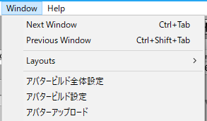

2. MyAvatarBuildSettingにはまず全体設定が必要です。

   **アバタービルド設定ウインドウ**を開くと全体設定が無いことを警告されるので、「全体設定」ボタンを押して**アバタービルド全体設定ウインドウ**を開き、**全体設定**ファイルを作成します。

   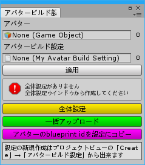

   （全体設定を完了するとこのウインドウで設定の適用が出来るようになります。）

3. **アバタービルド全体設定ウインドウ**で、参照アバターとしてアップロードしたいアバターを選択してください。

   **基本設定**はそれぞれのボタンを押すと自動設定されます。

   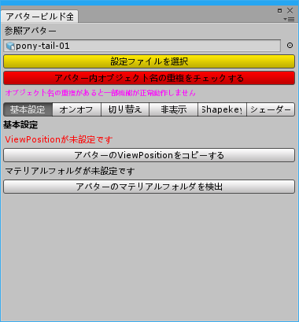

4. 次に**個別設定**を作ります。

   アセットのメニューから「Create」→「アバタービルド設定」を選ぶと設定が作成されます。

   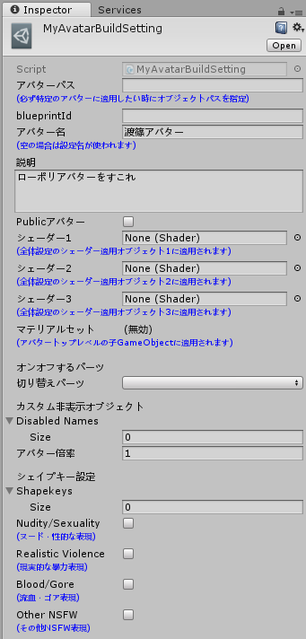

   既存のアバターであればblueprint id（「VRChat SDK」→「Manage Uploaded Contents」の「Copy ID」から取得可能）、アバター名、説明、Publicの可否等を設定できます。

   その他オブジェクトの表示制御やマテリアルの制御なども設定できますが、これは後の項目で説明します。

5. アバタービルド設定ウインドウから「一括アップロード」を開くと自動連続アップロードができるウインドウが出ます。

   

   機能を使用するには最初に指示に従ってパッチを適用してください。

   アバターと設定を選んで「アップロード」を押すとアップロード出来ます。

   

   ここで複数の設定を選ぶと**全てが連続自動アップロードされます**。

## 全体設定

- オブジェクトの表示オンオフ管理
- シェイプキー値管理
- シェーダー一括変更
- マテリアルの一括切り替え
- 複数アバター連続自動アップロード

等の機能を利用する場合、設定が必要です。

1. **パーツの表示オンオフ**設定を定義します。

   複数のオブジェクトをチェックボックスで簡単にオンオフ制御できるようになります。

   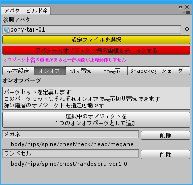

2. **パーツの表示切り替え**設定を定義します。

   基本的なユースケースではオンオフで十分だと思いますが、例えば複数の宣伝用の看板を出し分けたい等の場合に便利かと思います。

   オブジェクトを選択せずにボタンを押して、何も指定しない「なし」の設定を作ると何かと使いやすいと思います。

   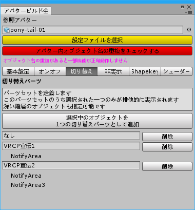

3. **カスタム非表示ブジェクト**の制御を指定します。

   特定の設定のみで例外的に非表示にするオブジェクトがある場合、毎回オンオフでチェックをつけるのではなく個別に指定することが出来ます。（例えば水着の時のみ服オブジェクトをオフにしたいなど）

   アバター直下のみまたは全階層ののオブジェクトの表示非表示を一括制御することによってこれを実現していますので、常に非表示にするものはここで指定してください。（表情制御用の予備顔メッシュなど）

   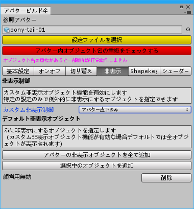

4. **シェイプキーの制御**を設定します。

   アバター直下のオブジェクトのシェイプキーを名前で管理して値を変更できます。

   デフォルトで0ではないシェイプキーがあれば指定してください。

   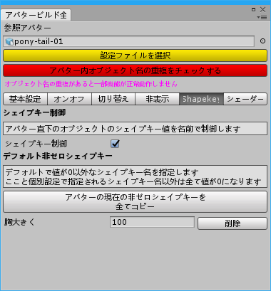

5. **シェーダーを一括変更**するオブジェクトを指定します。

   ワールドによってシェーダーを使い分けたり、試験的に複数のシェーダーを試したりする場合に便利です。

   シーンのオブジェクトを選択してボタンを押すと追加されます。

   いつもシェーダーを変更しない場合は設定しなくてかまいません。

   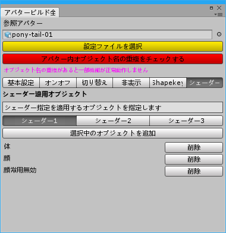

6. **マテリアル外部化**

   シェーダーの変更、及び後述のマテリアルフォルダを必要とする機能を使う場合マテリアルの外部化が必要になります。

   外部ファイルになっているマテリアルを必要とするので、fbxインポートで予め外部マテリアル形式にしておいてください。

   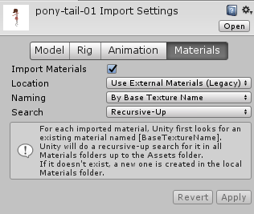

7. **設定ファイルを選択**すると、追加の設定がいくつかあります。

   

### ViewPosition

アバターの大きさが1倍の状態でのView Position（視点 VRC_Avatar Descriptorコンポーネントで指定する値と同一）です。

アバターの大きさを変更するオプションがあるため、これをベースとして使います。

アバタービルド全体設定ウインドウの基本設定にあるボタンから自動検出できます。

### マテリアルフォルダ

変更したい外部マテリアルがあるフォルダのパスを指定します。（Unityプロジェクトルートフォルダからの相対パス）

例: `Assets/MyModel/Materials`等

アバタービルド全体設定ウインドウの基本設定にあるボタンから自動検出できます。

### ファイルモード

この設定にはマテリアルフォルダが必要です。

ファイルパスベースでシェーダーを切り替えするモードです。

アニメーションでマテリアルを切り替える等、シーン中に存在しないマテリアルも切り替える必要がある場合ONにします。

この設定を有効にするとシェーダー適用オブジェクトは無視され、常にマテリアルフォルダ内の全てのマテリアルがシェーダー変更されるようになります。

### マテリアルセット名

この設定にはマテリアルフォルダが必要です。

部分的にマテリアルを変更したい場合に使います。

ここで指定したマテリアルセットが個別設定で選択可能になります。

**例**

例えば体のテクスチャを変更することで簡易的に水着を着せるというユースケースでは、以下のように体のテクスチャを変更したマテリアルを水着フォルダに作り、「マテリアルセット」に「水着」を指定すると、体のマテリアルのみ「水着」フォルダのものに変更されます。

```
MyModel/Materials/
                 |-体.mat
                 |-服.mat
                 |-顔.mat
                 |-水着/
                       |-体.mat
```

## 個別設定

個別の設定です。アセットの「Create」→「アバタービルド設定」で生成できます。

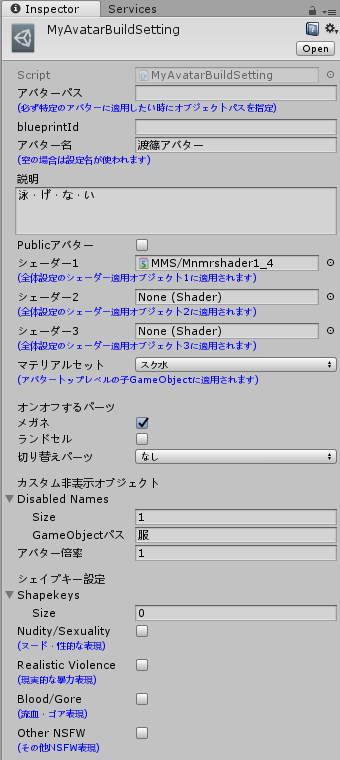

### blueprintId（ない場合新規アップロード）

blueprint idを指定します。

新規アバターがアップロードされても自動で更新はされないので、その設定のblueprint idを設定側に適用するようにして下さい。

VRChat SDKの「Manage Uploaded Contents」ウインドウから該当するアバターの「Copy Id」を押して、その値を設定のblueprint idの項目に貼り付けて下さい。

アバタービルド設定ウインドウのボタンで現在のアバターのblueprint idをコピーして設定することも可能です。

### アバター名

省略した場合、設定アセットの名前が使われます。

### 説明

アバターの説明です。

### Publicアバター

アバターをpublicにする場合はON。

### シェーダー

シェーダーを一括変更できます。

### マテリアルセット

マテリアルセットの指定です。

テクスチャ切り替えで水着にしたい等の場合に便利です。

### オンオフするパーツ

チェックボックスのオンオフで表示を制御できます。

### 切り替えパーツ

切り替えパーツのうち一つが表示できます。

### カスタム非表示オブジェクト

カスタム非表示制御が有効な場合、例外的に非表示にするオブジェクト名を列挙して設定できます。

テクスチャ切り替えで水着にしたい場合に服オブジェクトを非表示にする等に使えます。

### シェイプキー設定

シェイプキー制御が有効な場合、変更するシェイプキー名と値を列挙して設定できます。

アバターGameObjectの直下にある各子GameObjectの同名シェイプキー値が変更されます。

### 各種チェックボックス

アバターアップロード時の指定項目です。適切なものを指定してください。

## 注意事項

### パッチについて

本ツールはVRChat SDK本体のアップロード完了部分にパッチを当てることで一括アップロードを実現しています。

下記の画面にのようになっている場合パッチ未適用ですので、機能を使用する場合は「パッチ適用」ボタンを押してパッチを当てて下さい。

**注意: このパッチによって、VRChat SDKのアップロード完了時に通常の完了ダイアログボックスが出なくなります。**


### 新規アバターアップロード後のblueprint id更新

新規アバターがアップロードされた場合、その設定のblueprint idを設定側に適用するようにして下さい。

これをしない場合その設定が毎回新規アバターとしてアップロードされることになります。

VRChat SDKの「Manage Uploaded Contents」ウインドウから該当するアバターの「Copy Id」を押して、その値を設定のblueprint idの項目に貼り付けて下さい。

アバタービルド設定ウインドウのボタンで現在のアバターのblueprint idをコピーして設定することも可能です。

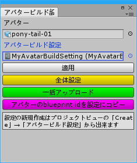

## 利用規約

- 本ツールの改変は自由です。
- 本ツールの再配布、販売は改変の有無を問わず禁止します
- 本ツールを利用することで発生したトラブルや損失、損害に対して、製作者は一切責任を負いません。本ツールを使用する際は利用者の責任において行ってください。
